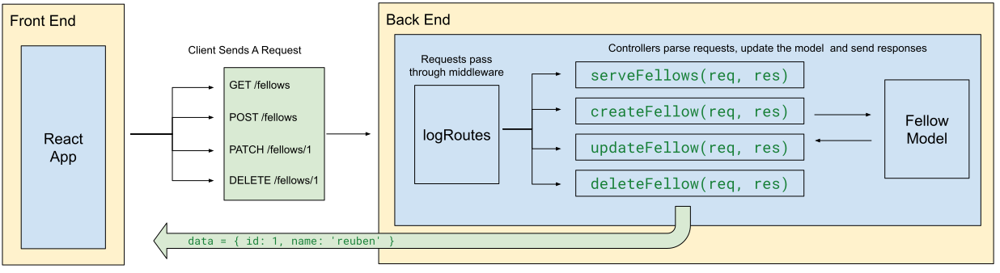
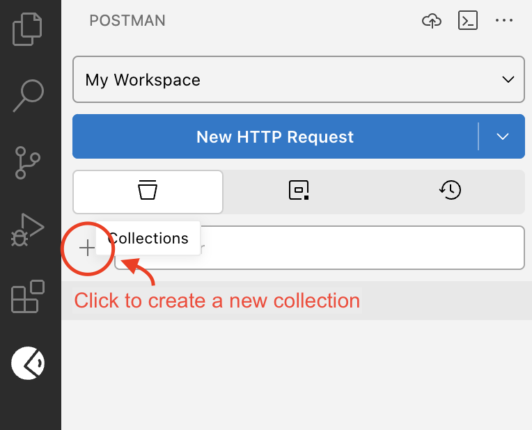
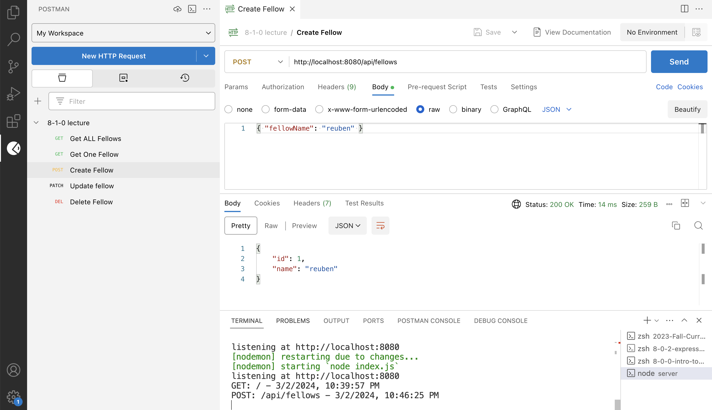

# Managing Data With a Model

In this lesson, we will introduce the Model layer to our server application design. At its core, a server manages data, defines API endpoints for accessing that data using CRUD operation, and provides frontend code to render a nice GUI for the user to more abstractly execute those CRUD operations. 

The Model is the portion of the server application that manages the CRUD operations for a server's collection of data. For example, a web-based todo application might:
- store an array of todo objects in memory
- define the endponts `GET /API/todos` and `POST /api/todos` to get all todos and to create a new todo
- provide a React application that fetches renders all the todos and a form that lets a user create a new todo. 

The piece of code that sits between the endpoints and the array of todo objects is the Model.

Let's jump in!

- [Terms](#terms)
- [Making an API for Managing Data](#making-an-api-for-managing-data)
- [REST](#rest)
- [Model — Adding a Data Management Layer](#model--adding-a-data-management-layer)
- [Route Parameters](#route-parameters)
- [Testing With Postman](#testing-with-postman)
- [Challenge](#challenge)

## Terms

- **REST API** — an API that conforms to the design principles of the representational state transfer (REST) architectural style.
- **Model** — an interface for managing a data structure. We will implement a model using a `class` with static methods for performing CRUD actions on a set of data.
- **Postman** — a tool for testing HTTP requests
- **Route Parameters** — named URL segments that are used to capture the values specified at their position in the URL. The captured values are populated in the `req.params` object

## Making an API for Managing Data 

In this lesson, we will build a server application that lets users manage a list of fellows. They can:
* (Create) Add a new fellow to the list
* (Read) Get all fellows
* (Read) Get a single fellow
* (Update) Change the name of a fellow
* (Delete) Remove a fellow from the list

To execute these operations, our server will create API endpoints where a client can send requests. For example, a `GET /api/fellows` request will send back all of the fellows managed by the application.

**Quiz! (Answer these with a fellow classmate)**
* Which action will a `GET /api/fellows/5` request perform?
* Which action will a `PATCH /api/fellows/5` request perform?
* Which action will a `POST /api/fellows` request perform?
* Why does the last endpoint not include a number?

## REST

These API endpoints follow the REST design pattern where endpoints look like: `/api/resources/:id`.

Representational state transfer (REST) is a design pattern for creating APIs that adhere to 6 pillars:

<details><summary>Uniform interface</summary>

* All API requests for the same resource should look the same, no matter where the request comes from. 
* The REST API should ensure that the same piece of data, such as the name or email address of a user, belongs to only one uniform resource identifier (URI). 
* Resources shouldn’t be too large but should contain every piece of information that the client might need.

</details><br>
<details><summary>Client-server decoupling</summary>

* The client and server applications must be completely independent of each other. 
* The only information that the client application should know is the URI of the requested resource; it can't interact with the server application in any other ways. 
* Similarly, a server application shouldn't modify the client application other than passing it to the requested data via HTTP.

</details><br>
<details><summary>Statelessness</summary>

* Each request needs to include all the information necessary for processing it.
* Server applications aren’t allowed to store any data related to a client request.

</details><br>
<details><summary>Layered System</summary>
* As a rule of thumb, don’t assume that the client, and server applications connect directly to each other. There may be a number of different intermediaries in the communication loop. 
* REST APIs need to be designed so that neither the client nor the server can tell whether it communicates with the end application or an intermediary.

</details><br>
<details><summary>Cacheable</summary>

* When possible, resources should be cacheable on the client or server side. 
* Server responses also need to contain information about whether caching is allowed for the delivered resource. 
* The goal is to improve performance on the client side, while increasing scalability on the server side.

</details><br>
<details><summary>Code on Demand (optional)</summary>

* REST APIs usually send static resources, but in certain cases, responses can also contain executable code (such as Java applets). In these cases, the code should only run on-demand.

</details><br>

## Model — Adding a Data Management Layer

The layered system component of a REST API is what we'll focus on here. We've already established that Express uses layers: when the server receives a request, it must pass through middleware and then controllers before a response is sent.

However, in the server applications we've built so far, the data and files we've sent as responses have all been static. 

To manage a dynamic set of data that allows for full CRUD operations, we need a data layer called a **model**. A model is an interface for managing a data structure. We will implement a model using a `class` with static methods for performing CRUD actions on a set of data.

Find the `models/Fellow.js` file:

```
server/
├── index.js
├── controllers/
│   └── fellowControllers.js
├── models/
│   └── Fellow.js
└── utils/
    └── fetchData.js
```

* `index.js` builds the `app`, configures middleware, and sets the endpoints. However, the controllers are now imported.
* `controllers/fellowControllers.js` defines all of the controllers for endpoints relating to fellow data. Each set of data should have its own controllers file.
* `models/Fellow.js` defines a model for managing fellow data. This model is used exclusively by the fellow controllers. Each set of data managed by the server should have its own model.

The flow of control is: **Client Request > Express `app` > Middleware > Controller > Model > Controller > Server Response**



## Route Parameters

https://expressjs.com/en/guide/routing.html#route-parameters

Named URL segments that are used to capture the values specified at their position in the URL. The captured values are populated in the req.params object

```js
// Route path: /users/:userId/books/:bookId
// Request URL: http://localhost:3000/users/34/books/8989
// req.params: { "userId": "34", "bookId": "8989" }

const serveBook = (req, res) => {
  const { userId, bookId } = req.params;
  console.log(userId, bookId); // 34 8989
}

app.get('/users/:userId/books/:bookId', serveBook)
```

## Testing With Postman

* Download the Postman VS Code Extension
* Create an Account on Postman
* Create a collection called `810 lecture`



* Add a request for each of your endpoints:
  * `GET /api/fellows`
  * `GET /api/fellows/:id`
  * `POST /api/fellows`
  * `PATCH /api/fellows/:id`
  * `DELETE /api/fellows/:id`
* Requests that require a body, select the **body** tab, then **raw**, and choose **JSON** from the type dropdown.
* Then, test out your server's endpoints using postman



## Challenge

Build a `Song` model and a server application for maintaining a playlist. Each song should have an `id`, a `title`, and an `artist` (at minimum). The model should provide an interface for:
* Creating a new song
* Getting all songs
* Getting a single song
* Updating the title or artist of a song
* Deleting a song

Then, create an endpoint and a controller for each of these pieces of functionality. The endpoints should follow REST conventions and should all begin with `/api`

Finally, build a frontend react application that can interact with the songs API that you've built. It should be able to:
* Create: Add a new song to the list.
* Read: Display a list of all songs.
* Read: Display a single song.
* Update: Update a single songs's title or artist.
* Delete: Delete a single song.

Here is a recommended React Router page structure for your React app:
* `/`: The homepage which includes:
  * Form for creating a new song
  * List of all songs
* `/songs/:id`: The details of a single song which includes
  * The title, artist, and ID of the song
  * A form to submit a new title or artist for the song
  * A button to delete the song from the list

