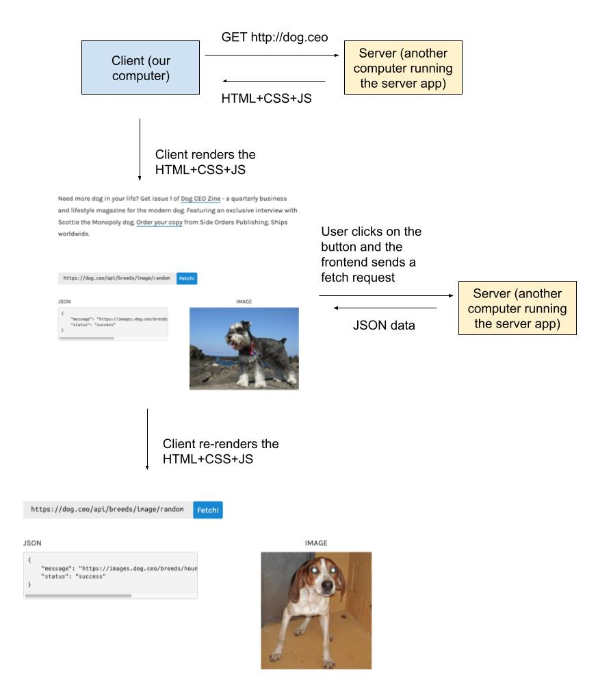

* What is a server? What role does it play?
  * Takes in requests from a client
  * Provides a response (JSON data, HTML+CSS+JS)
  * The backend for a web application
* What is the difference between a "server" and a "server application"
  * Server: the computer that runs the server application
  * Server Application: the code that makes up the server logic
* Deployment: the process of putting a server application on a server
  * `npm run dev` = us running the server application on our own computer (our computer is the server). The host is `localhost:8080` and only we can access it
  * When we deploy, the server that runs the application has a URL that can be accessed over the internet but anyone. The host is publicly accessible.

[Client Computer] <------------> [Server Computer] 

